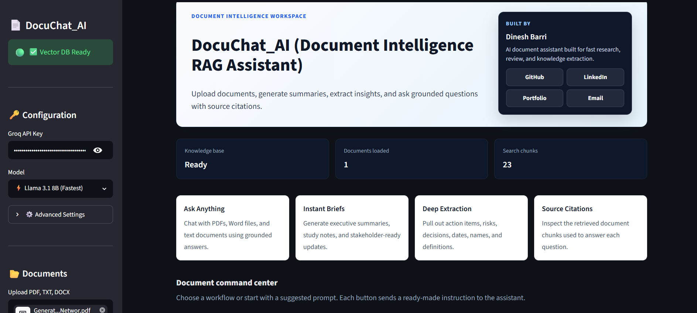
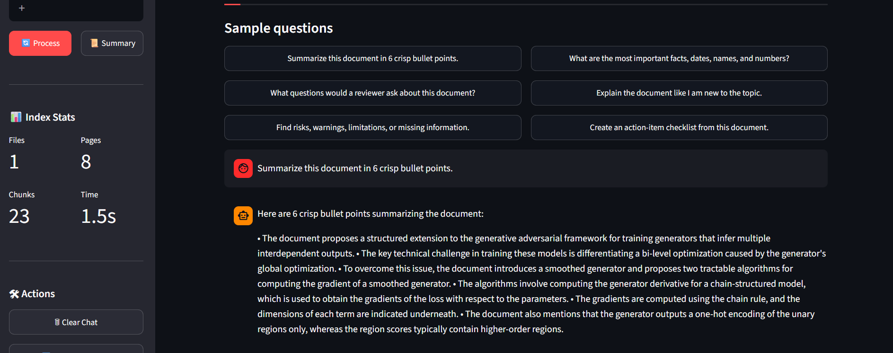
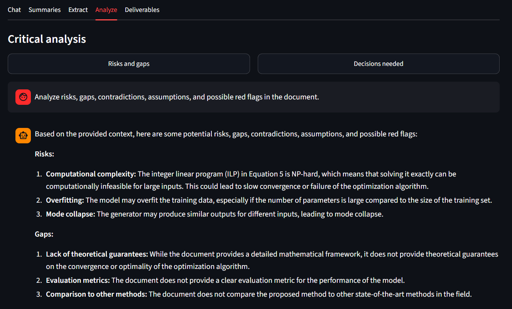

<div align="center">


<p>
  
</p>

<p>
  <a href="https://huggingface.co/spaces/dineshb/DocuChat_AI">
    
  </a>
  <a href="https://github.com/dineshbarri/DocuChat_AI">
    
  </a>
  <a href="LICENSE">
    
  </a>
</p>

<p>
  
  
  
  
  
  
</p>

**DocuChat_AI is a high-end AI document chatbot that lets users upload documents, generate summaries, extract insights, and ask grounded questions with source citations.**

</div>

---

## 🚀 Live Application

Try the app here:

### 👉 [Launch DocuChat_AI on Hugging Face](https://huggingface.co/spaces/dineshb/DocuChat_AI)

DocuChat_AI is designed for students, analysts, recruiters, researchers, founders, and professionals who need to understand long documents quickly without manually reading every page.

---

## 🖼️ Application Screenshots

> Add your screenshots inside the `assets/` folder using the exact filenames below. GitHub will automatically render them in this README.

<div align="center">

### 1. Premium Home Workspace


### 2. Document Processing and Indexing


### 3. Chat with Source Citations


### 4. Summary and Analysis Tools


</div>

---

## 📌 Project Overview

Most professionals deal with long PDFs, reports, resumes, policy documents, contracts, research papers, business notes, and technical files. Reading everything manually takes time, and generic chatbots can hallucinate when they are not grounded in the source document.

**DocuChat_AI solves this using Retrieval-Augmented Generation (RAG).**

The app extracts text from uploaded documents, splits it into searchable chunks, converts those chunks into embeddings, stores them in a FAISS vector index, retrieves the most relevant context for each question, and generates answers using an LLM while keeping responses grounded in the uploaded content.

---

## ✨ Key Features

| Feature | Description |
| --- | --- |
| 📄 Multi-document upload | Supports PDF, DOCX, and TXT files |
| 🧠 RAG-based Q&A | Ask natural-language questions about uploaded documents |
| 📋 Smart summaries | Generate executive summaries, study notes, email briefs, and key takeaways |
| 🔎 Source citations | View retrieved document chunks used to answer each question |
| 🧩 Workflow tabs | Chat, Summaries, Extract, Analyze, and Deliverables |
| ⚡ Quick action buttons | One-click prompts for risks, decisions, action items, FAQs, and presentation outlines |
| 📊 Index stats | Track processed files, pages, chunks, and processing time |
| 💬 Chat history | Maintains conversation context during the active session |
| ⬇️ Export support | Export chat history as Markdown |
| 🔐 Secure key input | Uses Hugging Face Secrets, environment variables, or password input |

---

## 🧠 What Users Can Do

- Upload a long PDF and ask: **"What are the main risks in this document?"**
- Turn a document into an **executive summary**
- Extract **names, dates, metrics, definitions, and action items**
- Generate **meeting notes, FAQs, email briefs, and presentation outlines**
- Ask follow-up questions using conversation history
- Inspect citations to understand where the answer came from

---

## 🏗️ RAG Architecture


### Pipeline Flow

1. **Document Upload** - User uploads PDF, DOCX, or TXT files.
2. **Text Extraction** - The app extracts readable text using document loaders.
3. **Chunking** - Text is split into manageable chunks with overlap.
4. **Embedding Generation** - Chunks are converted into vector embeddings.
5. **Vector Search** - FAISS retrieves the most relevant chunks for each query.
6. **LLM Generation** - Groq-powered models generate answers using retrieved context.
7. **Citation Display** - The app shows source previews used for the answer.

---

## 🛠️ Tech Stack

| Layer | Tools |
| --- | --- |
| Frontend | Streamlit |
| LLM | Groq API |
| RAG Framework | LangChain |
| Vector Database | FAISS |
| Embeddings | Hugging Face Sentence Transformers |
| Document Loading | PyPDF, DOCX2TXT, LangChain loaders |
| Text Splitting | LangChain text splitters + tiktoken |
| Deployment | Hugging Face Spaces |
| Language | Python |

---

## 📁 Repository Structure

```text
DocuChat_AI/
│
├── app.py                         # Main Streamlit application
├── README.md                      # Project documentation
├── requirements.txt               # Python dependencies
├── runtime.txt                    # Python runtime version for Hugging Face
├── Dockerfile                     # Optional container deployment file
├── LICENSE                        # MIT License
├── .gitignore                     # Local files and secrets ignored by Git
├── .gitattributes                 # Hugging Face / Git file handling
│
└── assets/
    ├── app_home.png               # Home UI screenshot
    ├── document_processing.png    # Upload and processing screenshot
    ├── chat_with_sources.png      # Chat answer and citations screenshot
    └── summary_tools.png          # Summary / analysis tools screenshot
```

---

## ⚙️ Local Setup

### 1. Clone the Repository

```bash
git clone https://github.com/dineshbarri/DocuChat_AI.git
cd DocuChat_AI
```

### 2. Create a Virtual Environment

```bash
python -m venv .venv
```

Activate it:

```bash
# Windows
.venv\Scripts\activate

# macOS / Linux
source .venv/bin/activate
```

### 3. Install Dependencies

```bash
pip install -r requirements.txt
```

### 4. Add Your Groq API Key

Create a `.env` file:

```env
GROQ_API_KEY=your_groq_api_key_here
```

You can create a Groq API key from:

👉 [https://console.groq.com/](https://console.groq.com/)

### 5. Run the App

```bash
streamlit run app.py
```

Open the local URL shown in your terminal.

---

## 🔑 How to Get a Groq API Key

1. Go to [Groq Console](https://console.groq.com/)
2. Sign in or create an account
3. Open **API Keys**
4. Create a new API key
5. Copy the key
6. Paste it into the app sidebar or save it in `.env`

For Hugging Face Spaces, add it as a secret:

```text
GROQ_API_KEY = your_key_here
```

---

## 🚢 Hugging Face Deployment

1. Create a new Hugging Face Space.
2. Choose **Streamlit** as the SDK.
3. Upload:
   - `app.py`
   - `README.md`
   - `requirements.txt`
   - `runtime.txt`
   - `.gitattributes`
   - `assets/`
4. Add `GROQ_API_KEY` in **Settings -> Secrets**.
5. Restart the Space after dependency changes.

---

## 💡 Example Questions

Try these after uploading and processing a document:

```text
Summarize this document in 6 crisp bullet points.
```

```text
What are the key risks, warnings, or limitations?
```

```text
Extract all names, dates, numbers, and important terms.
```

```text
Create an action-item checklist from this document.
```

```text
Explain this document like I am new to the topic.
```

```text
Create a presentation outline from this document.
```

---

## 🔐 Privacy and Security

- Uploaded files are processed through temporary files.
- The app does not intentionally store user documents.
- The FAISS index and chat history live inside the active Streamlit session.
- API keys should be stored in environment variables or Hugging Face Secrets.
- Avoid uploading highly confidential documents to public demo environments.

---

## ⚠️ Limitations

- Scanned PDFs may require OCR support, which is not included yet.
- Very large documents may be limited by CPU and memory on free hosting.
- Complex tables may not extract perfectly from PDFs.
- LLM answers should be reviewed for critical legal, medical, financial, or compliance use cases.
- Citation quality depends on document extraction and retrieval quality.

---

## 🚀 Future Improvements

- OCR support for scanned PDFs
- Multi-document comparison mode
- Persistent user workspaces
- Better page-level citation highlighting
- CSV, Excel, PPTX, and web page support
- Reranking for improved retrieval accuracy
- Authentication and private document libraries
- Downloadable summary reports
- Evaluation dashboard for retrieval quality

---

## 🧑‍💻 Author

<div align="center">

### Built by **Dinesh Barri**

Data Analyst | AI Automation Engineer | Founder @ Plemdo AI

<p>
  <a href="https://dineshbarri.dev">
    
  </a>
  <a href="https://github.com/dineshbarri">
    
  </a>
  <a href="https://www.linkedin.com/in/dinesh-barri-7654b010b/">
    
  </a>
  <a href="mailto:dineshbarri1997@gmail.com">
    
  </a>
</p>

</div>

---

## ⭐ Support

If you found this project useful, consider giving it a star on GitHub. It helps the project reach more developers, recruiters, and AI builders.

