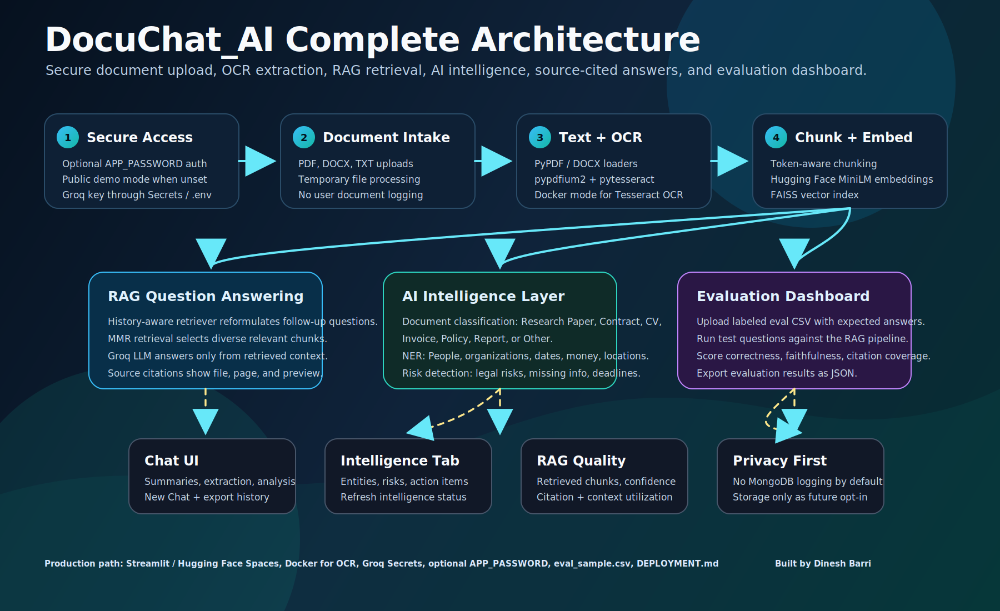

<div align="center">


<p>
  
</p>

<p>
  <a href="https://huggingface.co/spaces/dineshb/DocuChat_AI">
    
  </a>
  <a href="https://github.com/dineshbarri/DocuChat_AI">
    
  </a>
  <a href="DEPLOYMENT.md">
    
  </a>
  <a href="LICENSE">
    
  </a>
</p>

<p>
  
  
  
  
  
  
  
  
</p>

**DocuChat_AI is a production-style AI document intelligence assistant that turns documents into searchable knowledge, source-cited answers, extracted entities, risk signals, document classifications, and measurable RAG evaluation results.**

</div>

---

## Live Application

Launch the hosted application:

### [Open DocuChat_AI on Hugging Face](https://huggingface.co/spaces/dineshb/DocuChat_AI)

DocuChat_AI is built for analysts, students, recruiters, founders, researchers, and teams who need to understand long documents quickly while keeping answers grounded in source evidence.

---

## Why This Project Stands Out

Most document chatbots stop at upload and Q&A. **DocuChat_AI goes further** by adding a full AI intelligence layer:

- **RAG chat** with source-cited answers
- **OCR support** for scanned PDFs using `pytesseract` and `pypdfium2`
- **Document classification** into useful business/research categories
- **NER entity extraction** for people, organizations, dates, money, and locations
- **Risk detection** for legal risks, missing information, deadlines, and action items
- **Evaluation dashboard** for labeled test questions and measurable RAG quality
- **Optional authentication** using `APP_PASSWORD`
- **Privacy-first design** with no default MongoDB/PostgreSQL user logging

---

## Application Screenshots

Add your screenshots inside the `assets/` folder using these exact filenames.

<div align="center">

### 1. Premium Home Workspace


### 2. Document Processing and OCR


### 3. Chat with Source Citations


### 4. AI Intelligence Layer


### 5. Evaluation Dashboard


</div>

---

## Core Features

| Feature | What It Does |
| --- | --- |
| **Document Upload** | Upload PDF, DOCX, TXT, and text-based or scanned PDF files |
| **OCR for Scanned PDFs** | Uses `pypdfium2 + pytesseract + Pillow`; Docker mode installs Tesseract OCR |
| **RAG Q&A** | Ask natural-language questions over uploaded documents |
| **Source Citations** | Shows retrieved chunks, file names, pages, and preview snippets |
| **Document Classification** | Classifies files as `Research Paper`, `Contract`, `CV`, `Invoice`, `Policy`, `Report`, or `Other` |
| **NER Entity Extraction** | Extracts `People`, `Organizations`, `Dates`, `Money`, and `Locations` |
| **Risk Detection** | Detects `Legal risks`, `Missing information`, `Deadlines`, and `Action items` |
| **RAG Quality Metrics** | Shows retrieved chunks, confidence score, citation coverage, and context utilization |
| **Evaluation Dashboard** | Upload labeled CSV test questions and score answer correctness and faithfulness |
| **Workflow Tabs** | Chat, Summaries, Extract, Analyze, Intelligence, Evaluation, and Deliverables |
| **Optional Auth** | Add `APP_PASSWORD` to protect the app; omit it for public demo mode |
| **Privacy First** | No default database logging of user documents, prompts, or chat history |

---

## AI Intelligence Layer

The Intelligence tab transforms the app from a simple RAG chatbot into a document analysis workspace.

### Document Classification

The app classifies uploaded documents into:

```text
Research Paper / Contract / CV / Invoice / Policy / Report / Other
```

The current version uses **LLM-based classification**, which is lightweight and CPU-friendly for Hugging Face Spaces.

Future enhancement:

```text
If deployed on Hugging Face GPU, this can be upgraded to a fine-tuned BERT / RoBERTa classifier for faster and more consistent document-type prediction.
```

### NER Entity Extraction

The app extracts high-value entities:

```text
People
Organizations
Dates
Money
Locations
```

### Risk Detection

The app surfaces practical document risks:

```text
Legal risks
Missing information
Deadlines
Action items
```

### RAG Quality Metrics

Every answer can display:

```text
Retrieved chunks
Confidence score
Citation coverage
Context utilization
```

These metrics help users and recruiters see that the app is not just generating answers, but exposing retrieval behavior.

---

## Evaluation Dashboard

DocuChat_AI includes a labeled evaluation workflow for testing RAG quality.

Upload an evaluation CSV:

```csv
question,expected_answer,expected_source
What is the contract deadline?,The deadline is 15 June 2026.,contract.pdf page 3
Who is the policy owner?,The policy owner is the HR department.,policy.pdf
```

Then run the evaluation suite to measure:

| Metric | Meaning |
| --- | --- |
| **Retrieval Precision@K** | Whether relevant chunks are retrieved in the top results |
| **Answer Faithfulness** | Whether the answer is supported by retrieved context |
| **Answer Correctness** | Whether the answer matches the expected answer |
| **Citation Accuracy** | Whether the answer is backed by visible source citations |
| **Confidence Score** | Lightweight score combining retrieval/citation signals |

Included file:

```text
eval_sample.csv
```

---

## Complete Architecture

<div align="center">
  
</div>

### Pipeline Flow

1. **Secure Access** - Optional `APP_PASSWORD` protects private demos.
2. **Document Intake** - Users upload PDF, DOCX, TXT, or scanned PDFs.
3. **Text Extraction + OCR** - Text loaders handle normal files; OCR handles scanned PDFs in Docker mode.
4. **Chunking** - Documents are split into token-aware chunks with overlap.
5. **Embeddings** - Hugging Face sentence-transformer embeddings convert chunks into vectors.
6. **FAISS Vector Store** - Chunks are indexed for semantic search.
7. **Retriever** - History-aware retriever finds relevant context for each question.
8. **Groq LLM** - The model answers using only retrieved document context.
9. **Citations + Metrics** - Answers show source citations and RAG quality signals.
10. **Intelligence + Evaluation** - Classification, NER, risk detection, and labeled evaluation run on top of the document knowledge base.

---

## Tech Stack

| Layer | Tools |
| --- | --- |
| UI | Streamlit |
| RAG Framework | LangChain |
| LLM Provider | Groq |
| Embeddings | Hugging Face Sentence Transformers |
| Vector Store | FAISS |
| OCR | pypdfium2, pytesseract, Pillow, Tesseract OCR |
| Document Loaders | PyPDF, DOCX2TXT, LangChain loaders |
| Evaluation | Labeled CSV + LLM-as-judge scoring |
| Deployment | Hugging Face Spaces, Docker |
| Language | Python |

---

## Privacy and Data Policy

DocuChat_AI is intentionally privacy-first.

- Uploaded files are processed through temporary files.
- The FAISS index and chat history live in the active Streamlit session.
- The app does **not** log user documents, prompts, chat history, retrieved chunks, or feedback to MongoDB/PostgreSQL by default.
- MongoDB/PostgreSQL can be added later for user history, feedback, and analytics, but only with clear consent and security controls.
- API keys should be stored in Hugging Face Secrets or environment variables.

---

## Optional Authentication

You can protect the app with a simple environment secret:

```text
APP_PASSWORD=your_private_password
```

Behavior:

```text
If APP_PASSWORD is set -> app becomes password-protected
If APP_PASSWORD is not set -> app runs in public demo mode
```

---

## OCR Deployment Notes

OCR for scanned PDFs requires both Python packages and the Tesseract system binary.

Python dependencies:

```text
pypdfium2
pytesseract
Pillow
```

System dependency:

```text
tesseract-ocr
```

For reliable OCR on Hugging Face:

```text
Use Docker SDK
```

The included `Dockerfile` installs:

```text
tesseract-ocr
poppler-utils
```

---

## Project Structure

```text
DocuChat_AI/
│
├── app.py                         # Main Streamlit app
├── README.md                      # GitHub documentation
├── DEPLOYMENT.md                  # Deployment, OCR, auth, and eval guide
├── requirements.txt               # Python dependencies
├── runtime.txt                    # Python runtime
├── Dockerfile                     # Docker deployment with OCR system packages
├── eval_sample.csv                # Sample labeled evaluation file
├── LICENSE                        # MIT License
├── .gitignore
├── .gitattributes
│
└── assets/
    ├── complete_architecture.svg
    ├── app_home.png
    ├── document_processing.png
    ├── chat_with_sources.png
    ├── intelligence_tab.png
    └── evaluation_dashboard.png
```

---

## Local Setup

```bash
git clone https://github.com/dineshbarri/DocuChat_AI.git
cd DocuChat_AI
python -m venv .venv
```

Activate the environment:

```bash
# Windows
.venv\Scripts\activate

# macOS / Linux
source .venv/bin/activate
```

Install dependencies:

```bash
pip install -r requirements.txt
```

Create `.env`:

```env
GROQ_API_KEY=your_groq_api_key_here
APP_PASSWORD=optional_demo_password
```

Run:

```bash
streamlit run app.py
```

---

## Hugging Face Deployment

Standard text-based document mode:

```text
SDK: Streamlit
Hardware: CPU Basic or higher
```

OCR scanned PDF mode:

```text
SDK: Docker
Hardware: CPU Upgrade recommended
```

Required secret:

```text
GROQ_API_KEY=your_groq_key_here
```

Optional secret:

```text
APP_PASSWORD=your_private_demo_password
```

Full deployment instructions are available in:

```text
DEPLOYMENT.md
```

---

## Example Questions

```text
Summarize this document in 6 crisp bullet points.
```

```text
What are the legal risks, missing information, and deadlines?
```

```text
Extract all people, organizations, dates, money values, and locations.
```

```text
Classify this document and explain why it belongs to that category.
```

```text
Create an action-item checklist from this document.
```

```text
Generate a presentation outline from this document.
```

---

## Future Enhancements

- Fine-tuned BERT / RoBERTa document classifier for GPU deployments
- Persistent user workspaces with opt-in database storage
- MongoDB/PostgreSQL logging for metadata, feedback, and analytics with explicit user consent
- Qdrant or ChromaDB persistent vector storage
- User accounts and private document libraries
- Reranking for higher retrieval precision
- Page-level highlighted citations
- Multi-document comparison mode
- CSV, Excel, PPTX, and web URL ingestion

---

## Author

<div align="center">

### Built by **Dinesh Barri**

Data Analyst | AI Automation Engineer | Founder @ Plemdo AI

<p>
  <a href="https://dineshbarri.dev">
    
  </a>
  <a href="https://github.com/dineshbarri">
    
  </a>
  <a href="https://www.linkedin.com/in/dinesh-barri-7654b010b/">
    
  </a>
  <a href="mailto:dineshbarri1997@gmail.com">
    
  </a>
</p>

</div>

---

## Support

If this project is useful, consider starring the repository. It helps more developers, recruiters, and AI builders discover the project.

